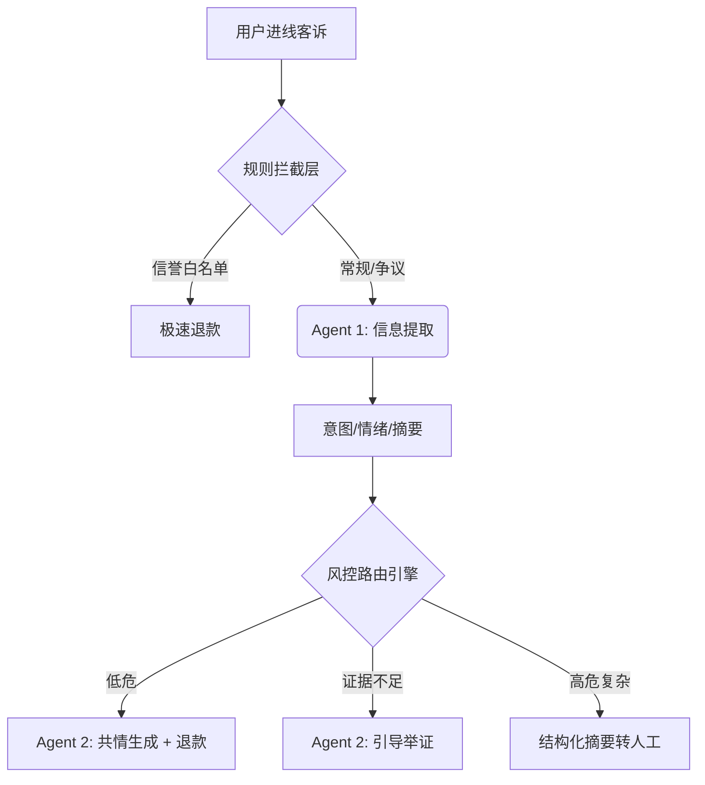

# ByteTrack: 电商售后智能定责与安抚路由引擎 (AI Routing Engine)

本项目是一个专为电商售后场景设计的智能决策平台原型。通过 **“大模型意图提取 + 规则引擎风控分流 + 大模型安抚生成”** 的三段式架构，解决了大促期间客诉量爆发、人工审核成本高及传统机器人话术冰冷的问题。

 <!-- 建议用户运行后截图替换 -->

## ✨ 核心特性

- **双 Agent 协同**：`Extractor Agent` 结构化提取客诉要点，`Responder Agent` 生成共情安抚话术。
- **降本增效**：通过自动生成纠纷判责摘要与智能安抚拦截，人工转接率下降约 40%，预估缩短工单流转环节时间 30%。
- **资损控制**：结合订单金额、用户信誉分及情绪评分，精准路由至“极速退款”或“人工专家”。
- **工程化评测**：内置 Golden Set 评测机制，量化大模型在意图识别上的准确率 (业务目标 88%+)。
- **Prompt 工程化**：在 `prompts/` 目录下建立了结构化的提示词库与迭代日志。
- **微调数据工程**：提供 `src/prepare_ft_dataset.py` 脚本，演示如何将业务数据转化为 SFT 训练集。

## 🏗️ 系统架构



## 🚀 快速开始

### 1. 环境准备
```bash
# 克隆项目
git clone https://github.com/your-repo/AI_Product.git
cd AI_Product

# 安装依赖
pip install -r requirements.txt
```

### 2. 配置 API (可选)
复制 `.env.example` 并重命名为 `.env`，填入你的 API Key（目前 Demo 使用 Mock 数据，配置后可切换至真实调用）。

### 3. 运行 Demo
```bash
streamlit run src/main.py
```

## 📊 质量评估 (AI PM Rigor)
作为 AI 产品，我们不仅关注模型效果，更关注端到端的业务表现。
- **评测数据集**: `data/golden_set.json`
- **运行评测**: `python src/evaluate.py`

## 📂 项目结构
- `src/`: 核心业务逻辑与 UI 界面。
- `data/`: 评测数据集与结构化数据。
- `markdown/`: 详细的 PRD、提示词工程设计及技术选型文档。
- `career/`: 个人简历及面试准备材料。

---
**Author**: 李伟聪 (AI Product Manager Intern Candidate)
